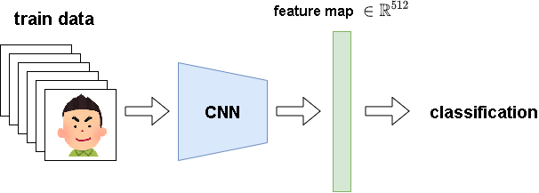
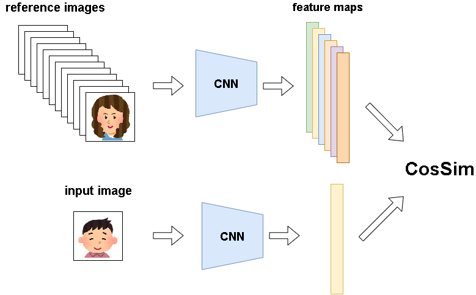
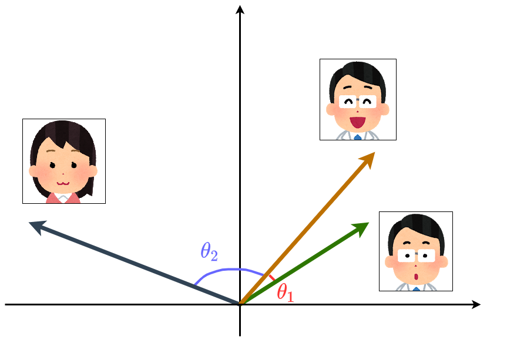

# FaceRecognition_kaira
  [](https://colab.research.google.com/github/KYM384/FaceRecognition_kaira/blob/main/demo.ipynb)

NF2020での展示作品用のレポジトリです。


## 使い方
[こちら](https://colab.research.google.com/github/KYM384/FaceRecognition_kaira/blob/main/demo.ipynb)からデモを実行できます。(上の`Open in Colab`をクリックしてもリンクを開けます。)

Pythonを使える環境があれば手元にダウンロードして実行して頂いても構いません。
必要なモジュールについては[環境](##環境)をご覧ください。


## 環境
 - Python 3.7
 - PyTorch 1.7
 - dlib (imutilsもインストールしてください)
 - Pillow
 - OpenCV

Colaboratory上では全てインストール済みです。なおCPUで実行するようにしているのでGPUは必要ありません。以下のコマンドで実行できます。
```
python demo.py hoge.png              #hoge.pngは読み込みたい画像のパスを指定してください。
python demo.py hoge.png --save_face  #検出した顔画像を保存します。
```


## 手法
ResNet18を10人分の顔画像で学習させています。より具体的には、下図のCNN(ResNet18)を通しfeature map $\in \mathbb{R}^{512}$を得て、全層結合に通してクラス分類を学習させています。


推論にはrefence imagesとして約70人分の画像を用意しています。これを上の学習済みのCNNに通しfeature mapに変換しておきます。入力された画像も同様にfeature mapに変換した後、refence imagesのfeature mapとコサイン類似度(CosSim)を取り、その値をscoreとします。デモではこのscoreの上位5番までを表示するようにしています。


コサイン類似度とは、2つのfeature mapをベクトルと見なした時の、成す角のコサインのことです。従って(学習が上手く行ったとすると)、画像同士が似ていればそのベクトルも同じような値となり、成す角は0に近くなり、コサインの値は1に近づきます。下図はそのイメージ図で、右側の2枚の男性の画像が成す角$\theta_1$は小さくなり、反対に左側の女性の画像との成す角$\theta_2$は大きくなります。

