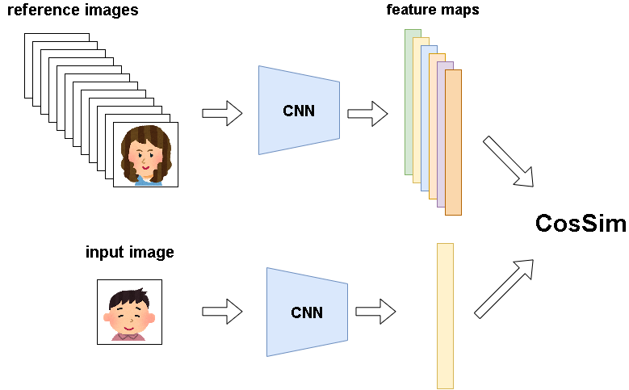
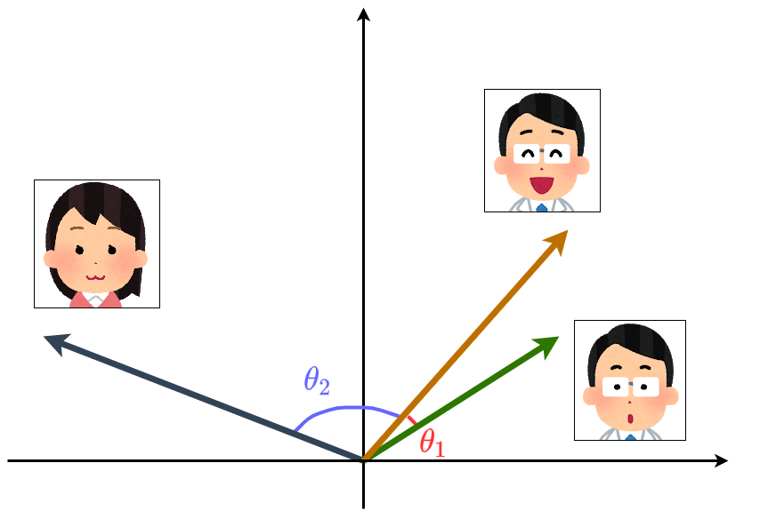

# FaceRecognition_kaira
[-red)](README.md) [](https://colab.research.google.com/github/KYM384/FaceRecognition_kaira/blob/main/demo.ipynb)

This is the repository for the work exhibited at NF2020.


## Run the demo
You can run the demo from [here](https://colab.research.google/github.com/KYM384/FaceRecognition_kaira/blob/main/demo.ipynb). (You can also open the link by clicking `Open in Colab` above.)

If you have a Python environment, you can clone and run the demo.
See [Environment](## Environment) for the required modules.


## Environment
 - Python 3.7
 - PyTorch 1.7
 - dlib (imutils should also be installed)
 - Pillow
 - OpenCV

All of these are already installed on Colaboratory. You don't need a GPU to run the program, as it is designed to run on the CPU. You can run it with the following command.
```
python demo.py hoge.png             #hoge.png is the path to the image you want to load.
python demo.py hoge.png --save_face #Save the detected face image.
```


## Method
We train ResNet18 for 10 persons images. More specifically, we through ResNet18 to get a feature map $\in \mathbb{R}^{512}$ and pass it through a FCN(Fully Conected Layer) to learn classifications, as shown in the figure below .


We have about 70 refence person images for inference. We pass them through the trained CNN above and convert them into a feature map. After converting the input images into a feature map in the same way, we take the Cosine Similarity of the feature map of the refence images, and use the value as the score. In the demo, the top 5 scores are displayed.


Cosine Similarity refers to the cosine of the angle between two feature maps when they are considered as vectors. Therefore, if the images are similar, their vectors will be similar, the angle between them will be close to 0, and the cosine value will be close to 1. Look at the bellow illustration. The angle $\theta_1$ between the two male images on the right becomes smaller, while the angle $\theta_2$ between the males and the female image on the left becomes larger, if it is trained well.
